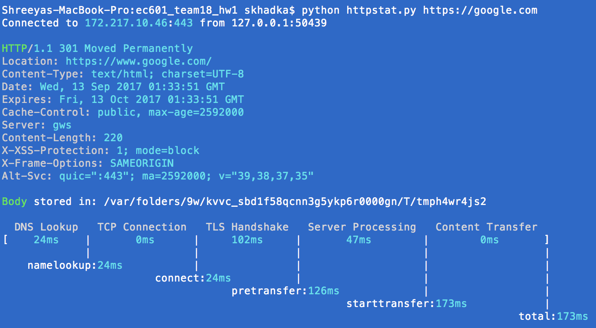

# EC601 A2 (Team 18)

## Assignment 1: Changes to httpstat [Option 1]

## Members
**angrySloth357**: Shreeya Khadka  
 
**squirrelbomb**: Tianzhi Wu  

**RunzhouHan**: Runzhou Han

## Summary
Changed the original httpstat program which gives statistics of a web-page connection via:

1. Adding option to print average statistics for a user defined number of web-connections to one website.
2. Changing the display font color.
3. Adding new display template. 

## Old Usage

Command:
```bash
python httpstat.py <url>
```

Example:
```bash
python httpstat.py https://google.com
```

**Old Sample Output:**




